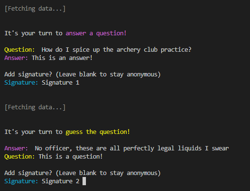
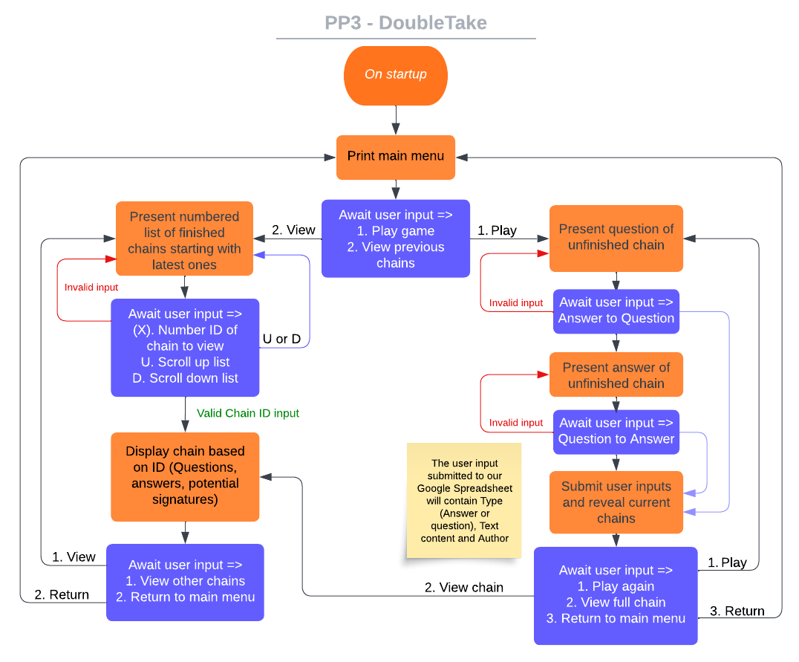
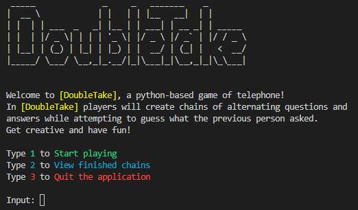
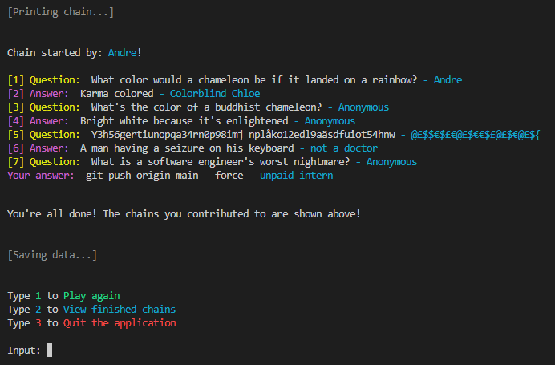
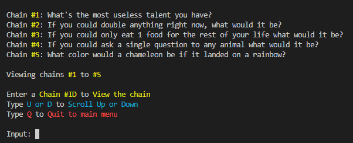

# DoubleTake - A Python-based game of telephone

[DoubleTake](https://doubletake.herokuapp.com/) was developed for anyone who enjoys a twist on traditional telephone games.

In this game players will create chains of alternating questions and answers while attempting to unravel what previous players have said, often with unpredictable results.

# Table of Contents
+ [UX](#ux "UX")
  + [User Stories](#user-stories "User Stories")
  + [Design](#design "Design")
+ [Flowchart](#flowchart "Flowchart")
+ [Data Storage](#data-storage "Data Storage)
+ [Features](#features "Features")
  + [Main Menu](#main-menu "Main Menu")
  + [The Game](#the-game "The Game")
  + [Chain Viewer](#chain-viewer "Chain Viewer")
  + [Input Validation](#input-validation "Input Validation")
+ [Development](#development "Development")
  + [Heroku Deployment](#heroku-deployment "Heroku Deployment")
+ [Testing](#Testing "Testing")
  + [General Testing](#general-testing "General Testing")
  + [Validator Testing](#validator-testing "Validator Testing")
  + [Bugs Encountered](#bugs-encountered "Bugs Encountered")
+ [Credits](#credits "Credits")

# UX

## User stories

### First Time Visitor Goals

- As a first time visitor, I want to enjoy a simple text-based multiplayer game
- As a first time visitor, I want to quickly grasp how to play the game
- As a first time visitor, I want to see what came before my contribution after finishing a round

### Returning Visitor Goals

- As a returning visitor, I want to look at finished chains to see what my past contributions led up to
- As a returning visitor, I want to easily navigate through menus with minimal effort 
- As a returning visitor, I want to see if any new chains have been finished

## Design
- Certain words and phrases are colored to guide the user's eyes and make interaction more intuitive
  - As an example, questions and answers are consistently yellow/magenta throughout the game, while signatures always appear in cyan
  

- As interacting with the spreadsheet through Google API may take a few seconds, subtle loading messages have been implemented to provide the user with some level of feedback while the application is working. 

# Flowchart

# Data Storage
Due to the nature of the game it required storing several simultaneous chains of questions/answers.  
I've opted to convert the User Data object being submitted to a JSON-formatted string which is then stored on a Google spreadsheet (can be viewed [here](https://docs.google.com/spreadsheets/d/1li_zDS9HltKV1cMbvn3x_Py7OmcUwD0XyyHjK1YEbKM/edit#gid=0)) 
While reducing legibility should we wish to alter the data directly, this allows us to increase the amount of simultaneous chains with ease should we wish to expand.

Upon a chain reaching completion it is moved from the "unfinished_chains" worksheet to the "finished_chains" one.

# Features

## Main Menu
The main menu features the title of the game and a quick introduction on what the game is about 

  
- From the main menu the user has 3 options:
  - *1* - Starts the game
  - *2* - Opens the chain viewer
  - *3* - Exits the application

## DoubleTake - The Game
DoubleTake is heavily inspired by the classic game of telephone, where a word is whispered between several people to the point where the original sentence is completely lost in translation.

The user will be asked to answer a player-provided question, to later try to guess the question of a player-provided answer.
The user may also include a signature of their choosing to keep track of their previous questions/answers, if no signature is provided it will default to "Anonymous".
Once finished answering the player will be provided with a post-game menu where all previous entries in the chain are shown.

This back-and-forth between players will continue until a chain of questions and answers is 8 entries long and marked as "Finished", it may then be viewed through the [Chain Viewer](#chain-viewer "Chain Viewer")

## Chain Viewer
The chain viewer can be reached from the main menu, this is where all finished chains can be viewed. 
- In the chain viewer the user has 3 options:
  - *Chain #ID* - Prints the chain with the ID entered
  - *U or D* - Scrolls up or down the list of chains
  - *Q* - Quits back to main menu

The bottom of the list features the latest 8 chains, when the list of chains exceeds 8 the user may scroll through the list using *U* or *D*

## Input Validation
- Main Menu
  - Menu input -> Simply checks if input is exactly "1", "2" or "3"
- During game
  - Question/Answer -> Ensures input isn't blank, string doesn't require further validation
  - Signature -> If left blank name will automatically be set to "Anonymous" as stated during input, string requires no further validation
- Chain Viewer
  - Menu input -> Checks if string is alphabetic and if so if it's "U", "D" or "Q".  
  If not try converting string to integer, if succesful check if integer is a valid chain index.

# Development

## Heroku Deployment
The project was deployed using Code Institute's mock terminal through Heroku (Link [here](https://doubletake.herokuapp.com/)) using the following steps:

1. Log in or create new account on [Heroku](https://dashboard.heroku.com/)
2. Create a new Heroku App
3. Set the buildbacks to `python` and `NodeJS` in that order
4. Link the Heroku app to your GitHub repository
5. In the app Settings tab, enter your credentials as a Config Var
6. Enter key PORT with value 8000 as another Config Var
7. In the Deploy tab, select your branch and click "Deploy Branch"

# Testing

## Validator Testing

- PEP8
  - No errors were returned from the [CI Python Linter](https://pep8ci.herokuapp.com/#)

## Bugs Encountered

- [RESOLVED] While trying to iterate through the data in each row of the Google spreadsheet, row_count would return 1000 instead of the amount of rows with data in them.
  - Google API - row_count returns the default max amount of rows in the spreadsheet rather than the rows with data, this was solved by simply exiting the loop on a row where no data is encountered
- [RESOLVED] During Heroku deployment - ERROR: No matching distribution found for pywin32==306, Push rejected, failed to compile Python app.
  - This was due to requirements.txt including requirements from my global python interpreter, this was resolved by creating a new venv (virtual environment) and rebuilding the requirements file from there
- After deployment to Heroku, Code Institute's mock terminal appears to have a different color scheme, appearing drastically darker than that specified in the code. This has yet to be resolved.

# Credits
Resources and tutorials used for developing this project:
- 
- [How to extract the last x elements from a list - StackOverflow](https://stackoverflow.com/questions/8556076/python-how-to-extract-the-last-x-elements-from-a-list)
- [Accessing the index in 'for' loops - StackOverflow](https://stackoverflow.com/questions/522563/accessing-the-index-in-for-loops)
- [Text to ASCII Art generator](https://patorjk.com/software/taag/) by [Patrick Gillespie](https://github.com/patorjk)
  - The font used is Big by Glenn Chappell
